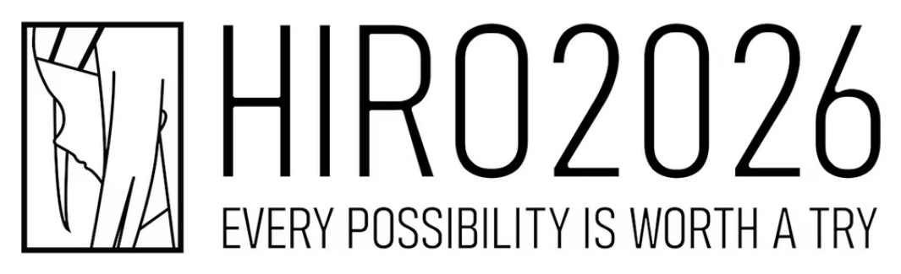
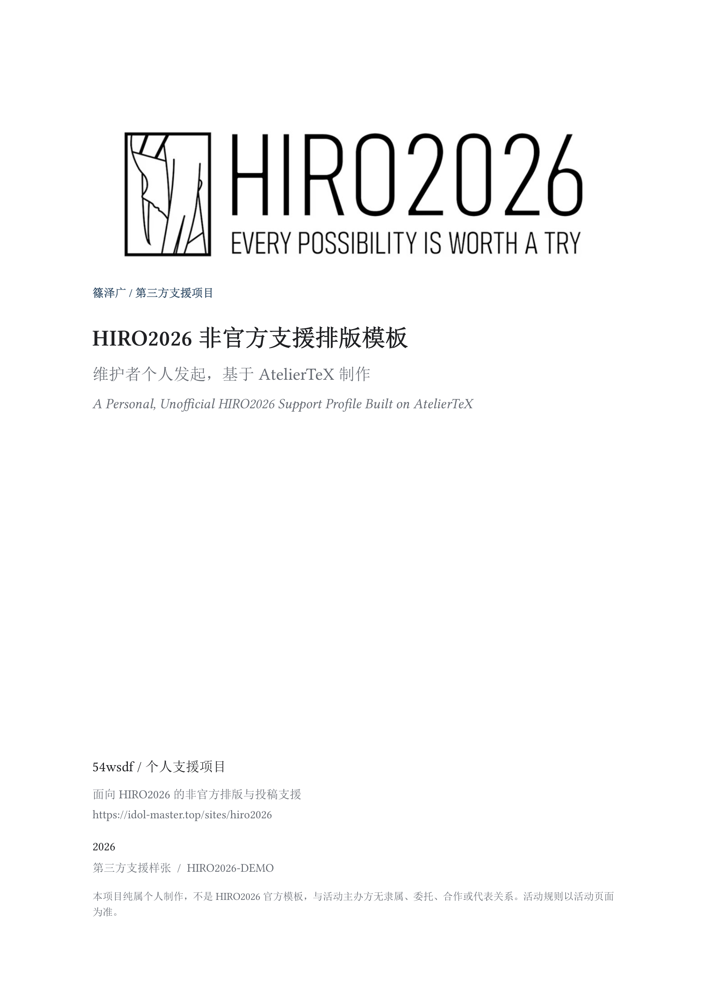
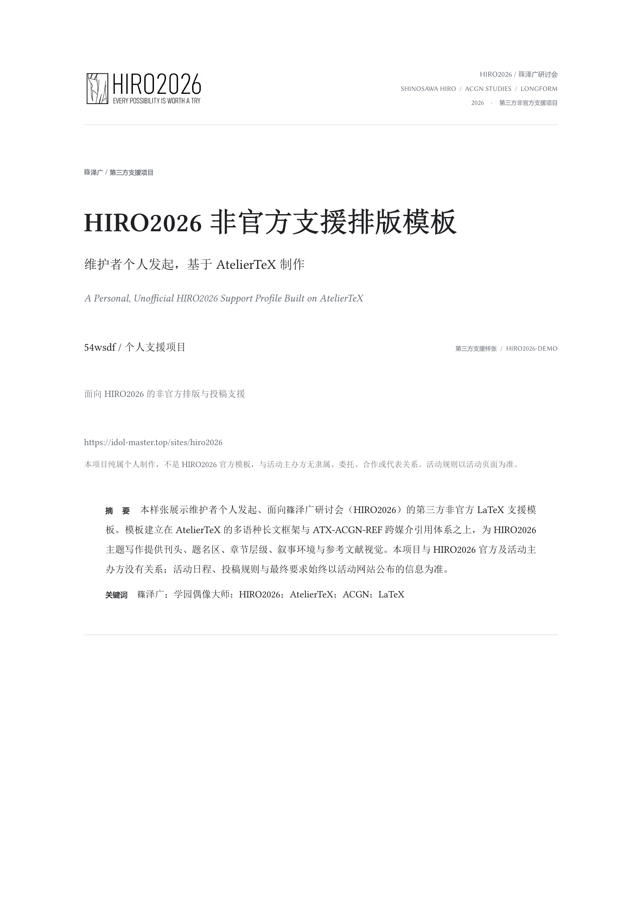
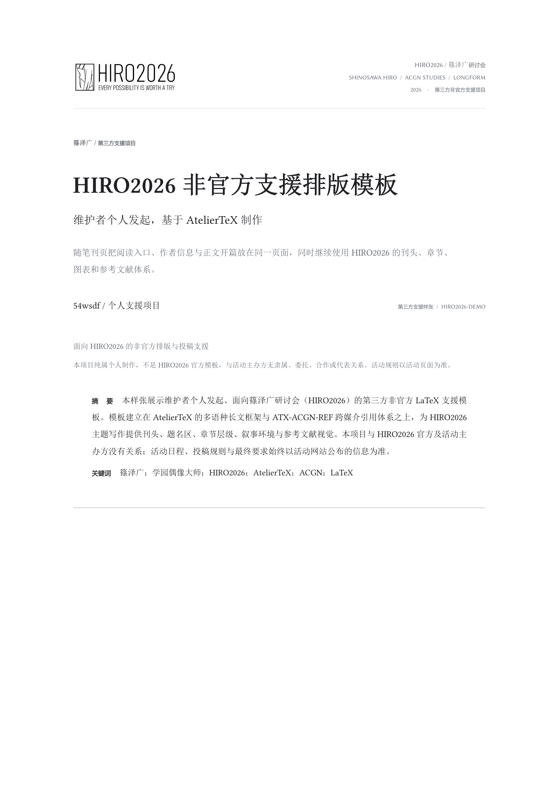

# atelier-profile-hiro

<p align="center">
  
</p>

> **由维护者个人发起、面向篠泽广研讨会（HIRO2026）的第三方非官方 LaTeX 支援项目，基于 [AtelierTeX](https://github.com/54wsdf/AtelierTeX)。**

<p align="center">
  <strong><a href="https://idol-master.top/sites/hiro2026">HIRO2026 活动 / 研讨会页面</a></strong>
  · <a href="https://github.com/54wsdf/AtelierTeX">AtelierTeX</a>
  · <a href="examples/profile-demo.tex">示例源码</a>
</p>

`atelier-profile-hiro` 完全由维护者个人发起和维护，仅为 HIRO2026 相关写作、排版与投稿准备提供工具支援。本项目不是官方模板，与 HIRO2026 官方、活动主办方、`idol-master.top`、《偶像大师》官方及相关权利方无隶属、委托、合作或代表关系。HIRO2026 Logo 发布方已[公开说明](https://www.xiaohongshu.com/explore/6a82f39c00000000080104dc)可自由取用 Logo 进行使用或创作；该许可不构成活动方对本项目的官方认可。

活动日程、征稿要求、投稿方式以及最终规则请以 **[HIRO2026 活动页面](https://idol-master.top/sites/hiro2026)** 为准；本仓库不发布或解释官方规则。

## 项目定位

这个仓库是基于 AtelierTeX 制作的活动主题排版扩展：

```text
AtelierTeX
通用 ACGN / 跨媒介长文基础框架
字体 · 多语种 · 基础布局 · 叙事语义 · ATX-ACGN-REF
        ↓
atelier-profile-hiro
面向 HIRO2026 的非官方支援排版扩展
刊头 · 标题页 · 章节视觉 · HIRO 叙事环境 · 会议主题书目呈现
        ↓
使用者的 HIRO2026 文稿
正文 · 图像 · 数据 · 论证 · 参考文献条目
```

| 层级 | 负责内容 |
| --- | --- |
| [AtelierTeX](https://github.com/54wsdf/AtelierTeX) | 面向 ACGN / 二次元 / 跨媒介人文研究的多语种长篇 LaTeX 基础框架；提供字体、语言、基础语义、通用排版能力与 ATX-ACGN-REF |
| `atelier-profile-hiro` | 将上述公共能力用于 HIRO2026 主题写作，提供 `hiro2026.cls`、活动主题刊头、标题页、叙事块与参考文献呈现 |
| 使用者文稿 | 使用模板完成文章；正文和研究材料由使用者自行管理 |

通用能力优先进入 AtelierTeX；HIRO2026 的 publication identity、活动主题视觉与专用呈现保留在本仓库。完整边界见 [`PROJECT.md`](PROJECT.md)。

## 为什么为 HIRO2026 单独做一个 profile

围绕 ACGN 作品写长文时，材料经常同时来自角色官网、游戏本体、剧情话数、卡面、PV、歌曲、Live、访谈、动画单集、漫画章节与玩家整理页。HIRO2026 profile 在 AtelierTeX 的公共能力之上，进一步处理中文长文与日文原文的混排、标题页与章节节奏、剧情和对白的叙事环境，以及 GAME / COMM / ANIME / MANGA / MUSIC / LIVE 等对象的 media tag 与 locator。

## 三种平行标题页排版

三种排版各自真实编译并保存独立渲染图；未来新增排版沿用同一注册机制。

| 名称 | 选择方式 | 适用问题 |
| --- | --- | --- |
| `feature` / 专题封面 | `titlelayout=feature` | 独立封面、公开长文、专题文章与展示页 |
| `symposium` / 研讨会刊页 | `titlelayout=symposium` | 投稿样张、会议论文与首页信息密度较高的文稿 |
| `essay` / 随笔刊页 | `profile=essay,titlelayout=essay` | 文化随笔、观察札记与叙事型长文 |

### Feature / 专题封面

<p align="center">
  
</p>

### Symposium / 研讨会刊页

<p align="center">
  
</p>

### Essay / 随笔刊页

<p align="center">
  
</p>

`symposium` 使用图形刊头、右侧活动信息与紧凑题名层级；`essay` 增加 deck 与叙事照片接口，并继续使用相同的章节、图表和书目体系。`titlelayout=v08` 作为 `symposium` 的兼容名称持续可用，也是一个可主动选择的排版入口。

默认图形刊头位可以替换为经过确认可分发的宣传图或其他 publication masthead：

```latex
\HIROSetMastheadImage{assets/my-approved-masthead.png}
\HIROSetMastheadImageWidth{39mm}
```

## 快速开始

推荐把 AtelierTeX 与本仓库放在同一工作目录：

```text
workspace/
├── AtelierTeX/
└── atelier-profile-hiro/
```

最小文档：

```latex
\documentclass[titlelayout=feature]{hiro2026}
\addbibresource{references.bib}

\HIROPaperType{Research Essay}
\HIROPaperID{HIRO2026-XXX}
\HIROShortTitle{短标题}
\HIROKicker{SHINOSAWA HIRO / LONGFORM}
\title{文章标题}
\HIROSubtitle{副标题}
\HIROEnglishTitle{English Title}
\author{作者}
\HIROAffiliation{单位 / 社团 / 研究机构}
\HIROContact{email@example.com}

\begin{document}
\maketitle
正文……
\end{document}
```

切换研讨会刊页：

```latex
\documentclass[titlelayout=symposium]{hiro2026}
```

切换随笔刊页与随笔正文节奏：

```latex
\documentclass[profile=essay,titlelayout=essay]{hiro2026}
\HIRODeck{一句承担阅读入口、而非摘要功能的导语。}
```

完整用法见 [`docs/USER_GUIDE.md`](docs/USER_GUIDE.md)。三种入口分别为 [`examples/profile-demo.tex`](examples/profile-demo.tex)、[`examples/profile-demo-symposium.tex`](examples/profile-demo-symposium.tex) 与 [`examples/profile-demo-essay.tex`](examples/profile-demo-essay.tex)。

## PDF 与 README 图像渲染

生成 README 首页图：

```powershell
pwsh -File tests/render-readme-preview.ps1 -Engine xelatex
```

脚本执行：

```text
hiro2026.cls + AtelierTeX
        ↓
profile-demo.tex                  → feature PDF
profile-demo-symposium.tex       → symposium PDF
profile-demo-essay.tex            → essay PDF
        ↓
pdftoppm：各自第一页 / 240 dpi / opaque RGB PNG
        ↓
hiro2026-feature-page1.png
hiro2026-symposium-page1.png
hiro2026-essay-page1.png
```

渲染脚本分别编译三份示例 PDF，再生成相应 PNG，并检查 A4 像素尺寸、RGB 色彩类型和图像完整性。详细说明见 [`docs/assets/rendered/README.md`](docs/assets/rendered/README.md)。

当前公开样张把第一页完整留给刊头、题名、作者、摘要和关键词；多语种与叙事环境示例从第二页开始。

## 跨媒介参考文献

模板通过 AtelierTeX 使用 ATX-ACGN-REF，在 GB/T 7714 正式条目前显示短 media tag。示例采用《学园偶像大师》与篠泽广相关的公开官方资料，直接演示 HIRO2026 主题下常见的引用对象。

```bibtex
@software{gakumas_game,
  author  = {{Bandai Namco Entertainment Inc.}},
  title   = {学園アイドルマスター},
  date    = {2024-05-16},
  url     = {https://gakuen.idolmaster-official.jp/},
  verba   = {GAME},
  langid  = {japanese}
}
```

正文使用 `\cite{...}`，文末可以加入：

```latex
\HIROReferenceLegend
\printbibliography
```

详细规范见 [`docs/BIBLIOGRAPHY.md`](docs/BIBLIOGRAPHY.md)。公共 ACGN 引用规范与完整对象目录由 [AtelierTeX / ATX-ACGN-REF](https://github.com/54wsdf/AtelierTeX) 维护。

## 编译与测试

推荐使用 TeX Live 2026、XeLaTeX 或 LuaLaTeX、`latexmk`、`biber`；生成 README 预览还需要 Poppler / `pdftoppm`。

```powershell
pwsh -File tests/compile-smoke.ps1 -Engine xelatex
pwsh -File tests/compile-smoke.ps1 -Engine lualatex
pwsh -File tests/compile-smoke.ps1 -Engine both
pwsh -File tests/render-readme-preview.ps1 -Engine xelatex
```

精确 AtelierTeX 依赖版本见 [`DEPENDENCY_LOCK.md`](DEPENDENCY_LOCK.md)。

## 仓库结构

```text
atelier-profile-hiro/
├── hiro2026.cls               # 文档类入口
├── hiro/                      # HIRO2026 publication modules
├── assets/                    # Logo / Mark 与可替换刊头资产
├── examples/                  # 可编译公开样张
├── docs/                      # 使用、模块、书目与渲染说明
├── tests/                     # 编译和 README 渲染脚本
├── PROJECT.md                 # 项目定位与第三方边界
├── CITATION.cff               # GitHub 引用元数据
├── LICENSE                    # LPPL-1.3c 正文
├── LICENSE_SCOPE.md           # 源码、视觉资产与商标边界
├── LICENSES/                  # Logo 公开许可记录
├── manifest.txt               # LPPL Work 逐文件清单
├── DEPENDENCY_LOCK.md
└── CHANGELOG.md
```

## 非官方支援项目声明

本项目纯属维护者个人兴趣发起的第三方支援项目，与 HIRO2026 官方及活动主办方没有关系。HIRO2026 活动信息请直接查阅 **[活动页面](https://idol-master.top/sites/hiro2026)**；本仓库不复制可能变化的征稿日期、活动安排或提交规则。

项目名称、作品名称、角色名称与相关商标归各自权利人所有。模板源码与文档采用 LPPL-1.3c；Logo、Mark 及含图预览按公开 Logo 使用与创作许可单独处理。完整边界见 [`LICENSE_SCOPE.md`](LICENSE_SCOPE.md)、[`manifest.txt`](manifest.txt)、[`LICENSE`](LICENSE) 与 [`LICENSES/LicenseRef-HIRO2026-Logo-Public-Use.txt`](LICENSES/LicenseRef-HIRO2026-Logo-Public-Use.txt)。

## 文档索引

- [`PROJECT.md`](PROJECT.md)：项目定位、第三方状态与 AtelierTeX 分工；
- [`docs/USER_GUIDE.md`](docs/USER_GUIDE.md)：完整使用说明；
- [`docs/MODULES_AND_STYLING.md`](docs/MODULES_AND_STYLING.md)：模块与样式职责；
- [`docs/BIBLIOGRAPHY.md`](docs/BIBLIOGRAPHY.md)：GB/T 7714 + ATX-ACGN-REF；
- [`hiro/README.md`](hiro/README.md)：各 `.sty` 模块说明；
- [`examples/README.md`](examples/README.md)：样张说明；
- [`tests/README.md`](tests/README.md)：测试说明；
- [`docs/assets/rendered/README.md`](docs/assets/rendered/README.md)：README 图像生成规则；
- [`assets/README.md`](assets/README.md)：视觉资产与权利边界；
- [`LICENSE_SCOPE.md`](LICENSE_SCOPE.md)：分层许可范围与非官方状态；
- [`CITATION.cff`](CITATION.cff)：项目引用元数据。
